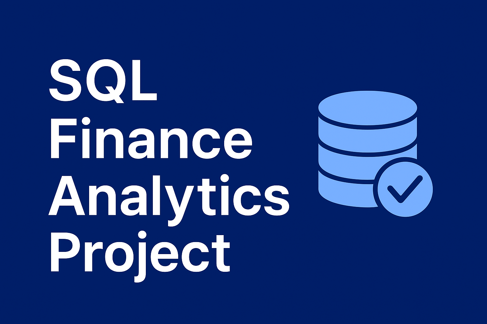

<p align="center">
  
</p>

# 📘 SQL Finance Analytics Project

## 📌 Project Overview

This project is a complete Finance Data Analysis SQL Project designed to demonstrate real-world data analytics skills using SQL. The dataset represents a financial company that issues loans, collects EMIs, and tracks defaults.

You will analyze:
* Customer demographics
* Loan portfolio performance
* EMI payment behaviour
* Loan default patterns
* Risk assessment insights

The project contains 2000+ records, realistic fields, and 50+ business-oriented SQL requirements.

## 📂 Project Structure

```
📁 SQL-Finance-Analytics-Project
│
├── 📄 README.md
├── 📄 requirement_sheet.pdf
├── 📄 ER_Diagram.png
├── 📁 dataset
│     ├── customers.csv
│     ├── loans.csv
│     ├── payments.csv
│     └── loan_defaults.csv
│
├── 📁 sql_queries
│     ├── 01_customer_analysis.sql
│     ├── 02_loan_portfolio.sql
│     ├── 03_payment_analysis.sql
│     ├── 04_default_analysis.sql
│     ├── 05_risk_insights.sql
│
└── 📄 final_report.pdf (optional)
```

## 🧵 Datasets Used

### 1. `customers`
Contains demographic and income details of customers.

| Column | Description |
|--------|-------------|
| customer_id | Unique customer ID |
| customer_name | Full name |
| age | Age in years |
| gender | Male/Female |
| city | Customer's city |
| annual_income | Yearly income |
| join_date | When customer joined |

### 2. `loans`
Contains loan-related details.

| Column | Description |
|--------|-------------|
| loan_id | Unique loan ID |
| customer_id | Linked customer |
| loan_type | Personal, Home, Auto, Business |
| loan_amount | Disbursed amount |
| interest_rate | Interest percentage |
| tenure_months | Loan tenure |
| start_date | Loan approval date |

### 3. `payments`
Tracks EMI payments for each loan.

| Column | Description |
|--------|-------------|
| payment_id | Unique payment ID |
| loan_id | Loan reference |
| payment_date | EMI paid date |
| emi_amount | EMI amount |
| due_date | Scheduled due date |
| payment_status | On-time / Late / Missed |

### 4. `loan_defaults`
Contains loan default details.

| Column | Description |
|--------|-------------|
| default_id | Unique default ID |
| loan_id | Loan reference |
| default_date | Date of default |
| default_amount | Outstanding at default |

## 🎯 Project Objectives

This project covers 5 major business areas:

### ✔ 1. Customer Analysis
* Customer segmentation
* Income distribution
* High-value customer identification
* City & age group analysis

### ✔ 2. Loan Portfolio Analysis
* Loan disbursement trends
* Loan type distribution
* High-exposure customers
* Interest rate analysis

### ✔ 3. EMI Payment Insights
* On-time vs Late vs Missed EMI trends
* Month-wise performance
* Customer-wise payment behaviour
* Revenue collected from EMIs

### ✔ 4. Loan Default Analysis
* Default patterns
* Risk factors
* High-loss loans
* Early defaults

### ✔ 5. Risk Assessment Insights
* Risk scoring model
* High-risk customer identification
* Income vs risk
* Loan type risk comparison

## 📌 SQL Skills Demonstrated

* Joins (INNER, LEFT, RIGHT)
* Subqueries & CTEs
* Window functions
* Aggregations
* DATE functions
* CASE expressions
* Grouping & ordering
* Data cleaning & validation
* Business insights from SQL

## 📝 How to Use This Project

1. Download the dataset from `/dataset` folder.
2. Import CSV files into your SQL environment:
   * MySQL
   * PostgreSQL
   * MSSQL
   * SQLite
3. Run SQL scripts provided in `/sql_queries`.
4. Review insights and prepare summary for the final report.

## 🏁 Deliverables

* ✔ Clean SQL queries
* ✔ Business insights
* ✔ Requirement sheet
* ✔ Final summarized PDF (optional)
* ✔ Risk scoring report

## 📊 Future Enhancements (Optional)

* Build a Power BI / Tableau dashboard
* Automate SQL scripts using Python
* Create stored procedures for reporting
* Add ML prediction (default prediction model)

## 🙌 Contributions

Contributions, suggestions, and improvements are welcome!

## 📞 Contact

For doubts or project help, reach out via GitHub Issues.